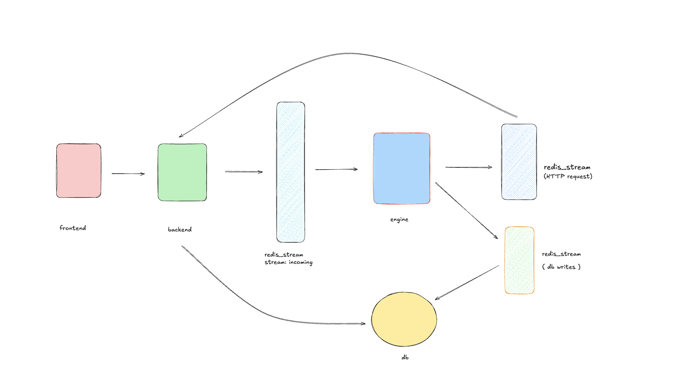
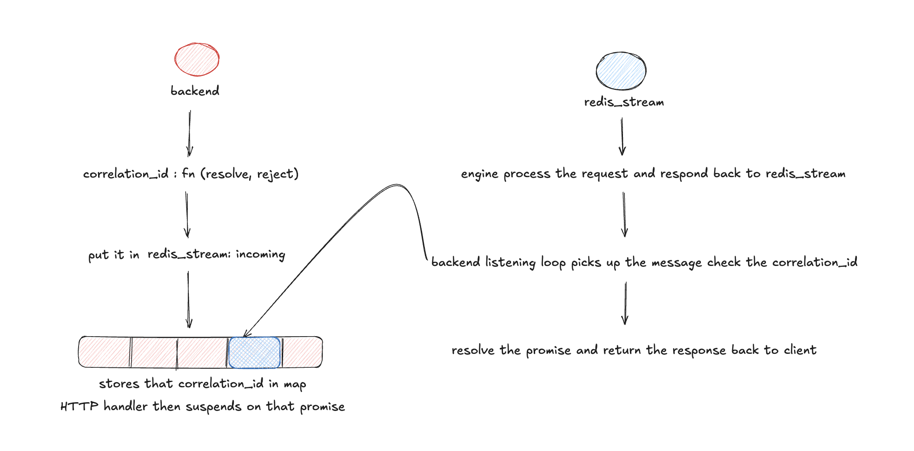

# Trading Engine

A high-performance order matching engine built with Redis Streams, Node.js, and PostgreSQL.

---

## Architecture Overview



The system has three independent services that communicate through Redis Streams.

| Service | Role |
|---|---|
| **Backend** | Receives HTTP requests, talks to Redis, reads from DB directly |
| **Engine** | Single-threaded order book, matching, liquidation, live mark price feed |
| **DB Poller** | Listens for events and writes to PostgreSQL |
| **DB** | PostgreSQL for persistent storage of balances, orders, fills, positions |

---

## Why Redis Streams (not Pub/Sub)

- **Pub/Sub is fire-and-forget** — if the engine is down, the message is lost
- **Streams persist messages** — unprocessed messages wait until the engine comes back
- **Consumer groups track acknowledgements** — Redis knows exactly which messages were processed

---

## The Three Streams

```
stream:incoming   →  Backend  ──►  Engine          (HTTP requests)
stream:response   →  Engine   ──►  Backend          (engine replies)
stream:events     →  Engine   ──►  DB Poller ──► PostgreSQL  (async DB writes)
```

**Backend reads from DB directly** for read-only queries (balances, order history). Only writes go through the engine → stream:events → db-poller path.

---

## Why the Engine is Single-Threaded

The order book cannot have race conditions. Two operations like "read user balance" and "lock user balance for a new order" must never run at the same time.

By using `COUNT 1` in `xReadGroup`, the engine picks up and fully processes one message before touching the next. The stream is the serialization point.

---

## The Correlation Pattern



How a single HTTP request travels through the system and comes back:

1. Backend generates a `correlationId` and stores `{ resolve, reject }` in a Promise map
2. Backend sends the request to `stream:incoming` with the `correlationId`
3. HTTP handler suspends — it's just an awaited Promise
4. Engine processes the message and writes the result to `stream:response`
5. Backend's listening loop picks up the response, looks up the `correlationId` in the map
6. Promise resolves → HTTP handler wakes up → response sent to client

Meanwhile, the engine also writes to `stream:events` and the db-poller updates PostgreSQL — independently, after the HTTP response is already sent.

---

## Inside the Engine

The engine is the core of the system. It has three responsibilities:

### 1. Order Matching

When an order arrives, the engine:
- Deducts margin from the user's available balance and locks it
- Tries to match the order against the opposite side of the order book
- If matched → creates fills and opens positions for both taker and maker
- If a limit order is partially filled or unmatched → the remainder rests on the order book
- Emits events for every state change: `ORDER_CREATED`, `FILL_CREATED`, `POSITION_OPENED`, `BALANCE_UPDATED`, `ORDER_UPDATED`

### 2. Mark Price Feed (Live WebSocket)

The engine connects directly to Binance's WebSocket (`wss://fstream.binance.com/ws`) and subscribes to `!markPrice@arr` — a real-time stream of mark prices for all futures markets.

On every price update:
- The engine updates its in-memory `MARK_PRICE` map
- Recalculates `unrealizedPnl` for every open position in that market
- Checks if any position has breached its liquidation price

If disconnected, it automatically reconnects after 3 seconds.

### 3. Liquidation

When a mark price crosses a position's liquidation price, the engine force-closes that position:
- Places a market order on the opposite side to close it
- Calculates `realizedPnl` from the fill prices
- Returns remaining margin (if any) to the user's available balance
- Marks the position as `closed`

Liquidation runs synchronously inside the mark price sweep — no separate service needed.

---

## The Two Redis Clients (per service)

One client cannot block-read and write at the same time. Each service needs two TCP connections to Redis.

**Engine**
| Client | Does |
|---|---|
| `brokerClient` | `xReadGroup` on `stream:incoming` |
| `responseClient` | `xAdd` to `stream:response` and `stream:events` |

**Backend**
| Client | Does |
|---|---|
| `publisher` | `xAdd` to `stream:incoming` |
| `subscriber` | `xReadGroup` on `stream:response` |

---

## Key Redis Commands Used

**Add a message to a stream**
```bash
await publisher.xAdd("stream:incoming", "*", {
  correlationId, responseQueue, type, payload
});
```

**Create a consumer group**
```bash
await client.xGroupCreate("stream:incoming", "engine", "$", { MKSTREAM: true });
# "$" = start from now (ignore old messages)
# MKSTREAM = create the stream if it doesn't exist yet
```

**Read messages (engine — one at a time)**
```bash
await brokerClient.xReadGroup(
  "engine",      // consumer group
  "worker-1",    // consumer name
  [{ key: "stream:incoming", id: ">" }],  // ">" = only new messages
  { COUNT: 1, BLOCK: 2000 }
);
```

**Acknowledge a message**
```bash
await subscriber.xAck("stream:response", "backend", [entry.id]);
```

---

## Tech Stack

- **Node.js** — Backend + Engine + DB Poller
- **Redis** — Message streaming between services
- **PostgreSQL** — Persistent storage
- **ioredis / node-redis** — Redis client

---

## Project Structure

```
/
├── backend/          # HTTP server, sends to stream:incoming, reads stream:response, reads DB
├── engine/           # Order matching, liquidation, mark price feed via Binance WebSocket
│   ├── handler/      # perps handler, mark price sweep, liquidation
│   └── store/        # in-memory order book, balances, positions, fills
├── db-poller/        # Consumes stream:events, writes to PostgreSQL
├── shared/db/        # PostgreSQL schema and migrations
```\